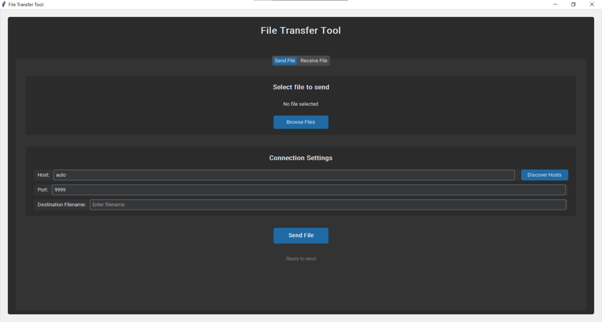
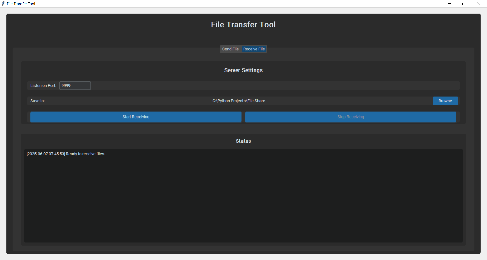

# 📁 Python File Share

A simple yet powerful **peer-to-peer file sharing app** built in Python! Works across devices on the same network.

Supports:
- ✅ One-to-one file transfers
- ✅ Auto host discovery
- ✅ Drag & Drop interface
- ✅ Multiple file transfers
- ✅ Transfer progress tracking
- ✅ File integrity check using SHA-256

---

## 🎯 Features

- 📤 **Sender Tab**  
  - Select files via file browser or drag & drop  
  - Enter host manually or use **Auto Discover**  
  - Custom destination filename  
  - Configurable port

- 📥 **Receiver Tab**  
  - Choose save location  
  - Start/Stop receiving with one click  
  - Set listening port

- 🔍 **Host Discovery**  
  - Scan and list available hosts on the network

- 📊 **Transfer Progress**  
  - Real-time file transfer status and logs

- 🔐 **Integrity Check**  
  - Uses SHA-256 to verify the file was transferred without corruption

- 📁 **Multi-file Support**  
  - Send multiple files in one go (automatically zipped)

---

## 📸 Screenshots

> 
> 

---

## 🚀 Getting Started

### ✅ Requirements
- Python 3.7+
- Cross-platform (Windows/Linux/macOS)
- No internet connection required (runs on local network)

### 🔧 Installation

##### 1. Clone the repo:
``` bash
git clone https://github.com/asim-builds/File-Share.git
cd File-Share
```

##### 2. Install dependencies:
    pip install -r requirements.txt

##### 3. Run the app:
    python main.py
    
### 📦 Packaging (Optional)
###### You can convert the files into an .exe using the following:
``` bash
pip install pyinstaller
pyinstaller --onefile main.py
```

---

## 🙌 Contributing
We welcome contributions!
Whether you're fixing bugs, adding features, or improving documentation, we appreciate your help.

Recommended contribution workflow...
``` bash
git clone https://github.com/asim-builds/File-Share.git
cd File-Share

# Install dependencies
pip install -r requirements.txt

# Create a new branch
git checkout -b your-feature-branch
```

When you are ready to submit the PR...
``` bash
git add .

# Commit your changes
git commit -m 'Add new feature'

# Push and create a PR
git push origin your-feature-branch
```

## 📢 License
MIT [License](LICENSE) – free to use, modify, and distribute.
